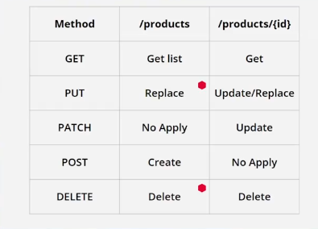

# ✨ consideraciones para producción:

- Cors: Que acceso y a quienes le damos acceso para hacer solicitudes
- Https: Que la API esta sobre servidor de HTTPS
- Procesos de Build: Se ve en procesos que cosas que tiene procesar información (typescript)
- Remover logs: No es bueno tener logs, a veces esto tiene demoras, existen mejor formas para capturar logs.
- Seguridad (helmet): Muy importante la seguridad y para esto se recomienda helmet que es una colección de Middleware que colocan capas de seguridad a la aplicación
- Testing: Correr pruebas unitarias o de integración antes de salir de producción

# ✨ Configuración del entorno de desarrollo

### 🧩 Git Ignore: ⠀⠀⠀⠀ 

Son archivos ignorados que suelen ser artefactos de compilación y archivos generados por el equipo que pueden derivarse de tu fuente de repositorios o que no deberían confirmarse por algún otro motivo. Ejemplo: node_modules.

### 🧩 ESLint:

**¿Que es ESLint?**

ESLint es una herramienta de código abierto que se utiliza para identificar y reportar patrones problemáticos o erróneos en el código JavaScript. Proporciona una manera de mantener un código JavaScript limpio y coherente dentro de un proyecto o equipo de desarrollo.

**Characteristics principales**

- Análisis estático del código JavaScript.
- Configuración personalizable.
- Integración con editores de código.
- Compatibilidad con ECMAScript.
- Amplia comunidad y soporte.
- Integración con sistemas de control de versiones.
- Integración con flujos de trabajo CI/CD.

**Configuración:**

- `root` Indica que esta configuración es para el proyecto, en general.
- `parserOptions` Define la versión de ECMAScript y el tipo de recursos, por ejemplo módulos.
- `extends` Permite agregar reglas a la configuración.
- `env` Define el tipo de entornos que ejecuta la aplicación.
- `rules` Define las propiedades que representan estados de producción

### 🧩 Editor Config: ⠀⠀⠀⠀ 

**¿Que es editorconfig?**

EditorConfig for VS Code es una extensión que permite mantener la consistencia en el estilo de codificación en un equipo de desarrollo de software a través de diferentes editores de texto y entornos de desarrollo, con un enfoque particular en Visual Studio Code.

**Characteristics principales**

- Estándares de formato
- Configuración personalizable.
- Consistencia entre equipos
- Soporte multiplataforma.
- Integración transparente.

## 📌 Creación de archivos necesarios:

- Comando `npm init -y`: para crear el archivo package.json y gestionar nuestros paquetes y crear tareas.
- Comando `git init` para iniciar un repositorio
- Creamos un archivo `.gitignore`: para indicar que debe ignorar git
- Creamos archivo `.editorconfig`: para configurar nuestro editor
- Creamos archivo `.eslintrc.json`: para las reglas de nuevas practicas

Ahora instalamos dependencias de desarrollo

`npm i eslint eslint-config-prettier eslint-plugin-prettier prettier -D`

# ✨ Instalación de Express.js y tu primer servidor HTTP

Express.js es el marco backend más popular para Node.js y es una parte importante del ecosistema JavaScript .

Está diseñado para crear aplicaciones web híbridas, de una sola página y de varias páginas; también se ha convertido en el estándar para desarrollar aplicaciones backend con Node.js y es la parte backend de algo conocido como pila MEVN.

MEVN es una pila de software JavaScript gratuita y de código abierto para crear sitios web y aplicaciones web dinámicos que tiene los siguientes componentes:

- MongoDB: MongoDB es la base de datos NoSQL estándar
- Express.js: el marco de aplicaciones web predeterminado para crear aplicaciones web
- Vue.js: el marco progresivo de JavaScript utilizado para crear aplicaciones web front-end
- Node.js: motor JavaScript utilizado para aplicaciones de red y del lado del servidor escalables.

Instalar express -> `npm i express`

# ✨ boom
Boom es un manejador de errores que se presenta de una manera mucho más comprensible. Lo que nos permite es manejar errores de forma amigable. Por ejemplo, si quisiéramos manejar un error Forbidden, simplemente los debemos hacer es: 
`Boom.forbidden([message], [data])`. Recordemos que el error de un forbidden es un `403`.

Fíjense que recordar todos los errores http es demasiado complicado. Hay errores `400`, errores `500`, entre otros.

Lo que hace Boom es facilitarnos su uso al darle el nombre directamente. Le podemos pasar un mensaje y nos devuelve una estructura bastante amigable con el status code, el error y el mensaje

Instalación -> `npm install @hapi/boom `

# ✨ Validación de datos con Joi

Joi es la herramienta más poderosa para la validación de datos en JavaScript. Este módulo permite crear esquemas de datos usando un lenguaje simple, comprensible e intuitivo.

A la hora de interactuar con una API, es muy importante que se validen los datos tanto en el lado del servidor como en el del cliente para tener controlados posibles errores y la forma en la que se interactúa con la base de datos.

Anteriormente Joi pertenecía al ecosistema de Hapi, un framework para crear aplicaciones en Node, pero a partir de la versión 12.1.0 decidió dejar de formar parte de este framework y ser un paquete totalmente independiente, lo cual facilita aún más la integración con este.

Integrar Joi en nuestro proyecto

Lo instalaremos como dependencia en el proyecto:

`$ npm install joi` 

# ✨ ¿Qué es una RESTful API?

**REST (Representational State Transfer)**

Es una convención que comúnmente se utiliza para desarrollar servicios web, que al final se comunican por el protocolo HTTP.

Este protocolo tiene varios métodos:
- Get: Obtener
- Put: Modificar/Actualizar
- Patch: Modificar/Actualizar
- Post: Crear
- Delete: Eliminar

La convención de REST nos dice que por cada casi entidad que tengamos tendremos una ruta, un endpoint con un nombre, y también deberíamos tener un `id` por cada producto.

Si queremos obtener la lista de productos usaremos el método `GET` con la ruta de productos. Sí queremos una ruta en particular repetimos el endpoint, pero esta vez enviamos el `id`.

`PUT`, podríamos usar Replace y modificar una lista entera (mala práctica), lo ideal es usarlo con un solo producto.

`PATCH`, podemos hacer una actualización mucho más detalladas, de que cosas quiero modificar.

`POST`, nos sirve para crear.

`DELETE`, no deberíamos eliminar en masa, es muy peligroso, ideal es eliminar uno a uno.

>[!NOTE] Los endpoints son las URLs de un API o un backend que responden a una petición. Los mismos entrypoints tienen que calzar con un endpoint para existir. Algo debe responder para que se renderice un sitio con sentido para el visitante.

# ✨ ¿Qué es Heroku?

Heroku es una plataforma de servicios en la nube (conocidos como PaaS o Platform as a Service) que permite manejar los servidores y sus configuraciones, escalamiento y la administración. Su popularidad ha crecido en los últimos años debido a su facilidad de uso y versatilidad para distintos proyectos.

Heroku es uno de los PaaS más utilizados en la actualidad en entornos empresariales por su fuerte enfoque en resolver el despliegue de una aplicación. En otras palabras, a Heroku solo le dices qué lenguaje de backend estás utilizando o qué base de datos vas a utilizar y te preocupas únicamente por el desarrollo de tu aplicación.
